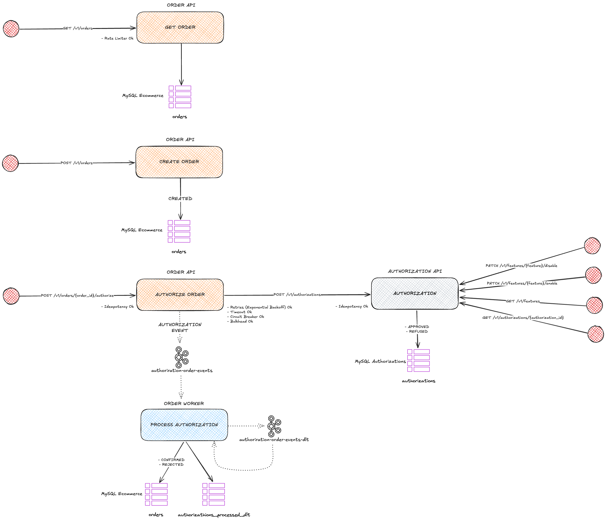

# Sample of Resilience Patterns for Services Integration
> Explanations about patterns applied on API, HTTP Client, and Pub/Sub integrations.

---

## Project Structure


## Upping The Development Environment
```shell
# With docker-compose
docker-compose up -d
```
```shell
# With Make
make up
```

## Restarting The Development Environment
```shell
# With docker-compose
docker-compose restart
```
```shell
# With Make
make restart
```

## Downing The Development Environment
```shell
# With docker-compose
docker-compose down --remove-orphans --volumes
```
```shell
# With Make
make down
```

## Downloading The OpenTelemetry Agent
```shell
make otel-agent
```
> :information_source: _Use the OTEL agent passing the java agent to the VM arguments: `-javaagent:.otel-dev/otel.jar`_

## Open Telemetry Environment Variables Configuration

### order-api
```
OTEL_METRICS_EXPORTER=otlp
OTEL_EXPORTER_OTLP_METRICS_COMPRESSION=gzip
OTEL_EXPORTER_OTLP_METRICS_ENDPOINT=http://localhost:4318/v1/metrics
OTEL_TRACES_EXPORTER=otlp
OTEL_EXPORTER_OTLP_TRACES_COMPRESSION=gzip
OTEL_EXPORTER_OTLP_TRACES_ENDPOINT=http://localhost:4318/v1/traces
OTEL_LOGS_EXPORTER=none
OTEL_SERVICE_NAME=order-api
```

### authorization-api
```
OTEL_METRICS_EXPORTER=otlp
OTEL_EXPORTER_OTLP_METRICS_COMPRESSION=gzip
OTEL_EXPORTER_OTLP_METRICS_ENDPOINT=http://localhost:4318/v1/metrics
OTEL_TRACES_EXPORTER=otlp
OTEL_EXPORTER_OTLP_TRACES_COMPRESSION=gzip
OTEL_EXPORTER_OTLP_TRACES_ENDPOINT=http://localhost:4318/v1/traces
OTEL_LOGS_EXPORTER=none
OTEL_SERVICE_NAME=authorization-api
```

### order-worker
```
OTEL_METRICS_EXPORTER=otlp
OTEL_EXPORTER_OTLP_METRICS_COMPRESSION=gzip
OTEL_EXPORTER_OTLP_METRICS_ENDPOINT=http://localhost:4318/v1/metrics
OTEL_TRACES_EXPORTER=otlp
OTEL_EXPORTER_OTLP_TRACES_COMPRESSION=gzip
OTEL_EXPORTER_OTLP_TRACES_ENDPOINT=http://localhost:4318/v1/traces
OTEL_LOGS_EXPORTER=none
OTEL_SERVICE_NAME=order-worker
```

## Hosts Dev
| Host                   | Description                       |
|------------------------|-----------------------------------|
| http://localhost:8080  | OpenAPI Order API                 |
| http://localhost:8081  | OpenAPI Authorization API         |
| http://localhost:8580  | Kafka UI                          |
| http://localhost:4317  | OpenTelemetry GRPC Collector Port |
| http://localhost:4318  | OpenTelemetry HTTP Collector Port |
| http://localhost:16666 | Jaeger                            |
| http://localhost:9090  | Prometheus                        |
| http://localhost:3000  | Grafana                           |
